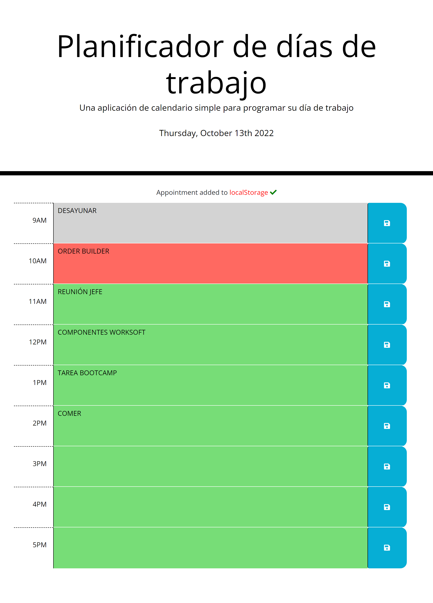

# Agenda diaria

## En este quinto desafío se ha creado una aplicación de agenda diaria que cumple con la siguiente funcionalidad:

* La aplicación muestra el día actual en la parte superior de la agenda
* La aplicación muestra bloques de tiempo para el horario laboral estándar
* Cada bloque de tiempo está codificado por color:
    * Los bloques de tiempo en color gris se encuentran en el pasado
    * El bloque de tiempo en color rojo se encuentra en el presente
    * Los bloques de tiempo en color verde se encuentran en el futuro
* Cuando se hace clic en un bloque de tiempo, se puede ingresar un evento
* Cuando se hace clic en el ícono de guardar de cada botón, se puede guardar el evento introducido en el almacenamiento local 
* Cuando se guarda el evento, se despliega un mensaje de éxito en la parte superior de la agenda
* Cuando se recarga la página, los eventos guardados persisten
* Cuando hay un cambio de día, la agenda se limpia por completo

## Se puede acceder a la aplicación por medio del siguiente link:

* [Link a aplicación](https://jorgeramirezanzaldo.github.io/Agenda-diaria/)

## La aplicación luce tal como se muestra en la siguiente imagen:

## A continuación se presenta una animación sobre el funcionamiento de la aplicación:

